# Feature Engineer — Pi Extension

A spec-driven feature development workflow for [Pi](https://pi.dev). This extension
orchestrates requirements gathering through to git commit, with user approval at
every design phase and aggressive context management to keep each LLM session
minimal.

## Layout

```
.pi/extensions/feature-engineer/   ← the extension source
  index.ts                         ← entry point: registers /feature command
  state.ts                         ← canonical workflow steps + transitions
  paths.ts                         ← directory & file path helpers, slug/ID logic
  files.ts                         ← reads project files (templates, configs, artifacts)
  init.ts                          ← init-status checks
  persistence.ts                   ← fe-state validation + routing helpers
  routing.ts                       ← subcommand parsing, severity routing
  seeding.ts                       ← global template seeding (see below)
  qa.ts                            ← qa-static-tools.md parser + result aggregation, red-phase check
  approve-gate.ts                  ← deterministic artifact validation for /feature approve
  git-checks.ts                    ← branch-name/commit-format parsing, checks, branch create/checkout
  rate-limit.ts                    ← provider rate-limit header parsing + gate
  version.ts                       ← package version resolution
  features-index.ts                ← features-index.md parser/formatter
  dates.ts                         ← YYYY-MM-DD helper
  skills/                          ← per-skill session orchestrators (runner.ts shared)
  prompts/                         ← pure prompt builders (one per skill + common.ts)

.feature-engineer/templates/       ← shipped defaults, seeded to the user's home dir
  config/                          ← actors, structure, tech-stack, qa-*, git-strategy
  artifacts/                       ← requirement, technical-architecture, technical-plan-*, review-concerns

tests/                             ← vitest suite (493 tests, dev-only, not published)
```

## File naming convention

Files generated by the spec-driven workflow are prefixed with a two-digit
number reflecting the order in which they are produced. This makes a plain
`ls -1` show the files in generation order without any extra tooling.

**Per-project config files** (in `.feature-engineer/`, written by the
Analyse Codebase skill):

```
01-actors.md
02-structure.md
03-tech-stack.md
04-qa-static-tools.md
05-qa-engineering.md
06-git-strategy.md
```

**Per-feature artifacts** (in `feature-NNN-slug/`, written by the per-feature
skills):

```
01-requirement.md              # req-gathering
02-relevant-components.md     # tech-design phase 1 (intermediate)
03-technical-architecture.md  # tech-design phase 2
04-technical-plan-testing.md  # test-planning
05-technical-plan-implementation.md  # impl-planning
06-review-concerns-to-address.md  # review-completion (5 passes + git checks)
```

**Project root registry** (unprefixed — it's a special metadata file, not a
spec artifact):

```
features-index.md              # maintained by the github skill
```

**Global templates** (in `~/.pi/agent/feature-engineer/templates/`, unprefixed):

```
config/actors.md, config/structure.md, ...           # unprefixed
artifacts/requirement.md, ...                       # unprefixed
```

The prefix is for the GENERATED artifacts in a project, not the seed
templates. The type names used in code (`ConfigFileName`,
`ArtifactFileName`) stay unprefixed; the prefix is applied by the
path helpers (`configFilePath`, `artifactPath`, etc.) in `paths.ts` so
callers don't have to know the numbers.

## Global template installation

Templates are **global for the user**, not per-project. On the first invocation
of `/feature` (and idempotently on every invocation), the extension copies the
bundled defaults from inside the installed package into:

```
~/.pi/agent/feature-engineer/templates/
  config/   (actors.md, structure.md, tech-stack.md, qa-static-tools.md,
             qa-engineering.md, git-strategy.md)
  artifacts/(01-requirement.md, 03-technical-architecture.md,
             04-technical-plan-testing.md, 05-technical-plan-implementation.md,
             06-review-concerns.md)
```

After the first run, a one-time notification appears:

> *Feature Engineer: seeded 11 default templates into
> /Users/you/.pi/agent/feature-engineer/templates. Customise them freely.*

The user customises templates **once** at this location; every project they
open afterwards picks up the customised versions. Existing files at the target
are preserved — the extension never overwrites user edits.

The extension works out of the box for any install method (npm, git, local
file, symlink, copy). No manual template setup is needed.

### Template conventions

Templates use two authoring aids that the LLM is told to remove when populating
the final document:

- `{{PLACEHOLDER}}` — concrete content goes here. The LLM substitutes these
  with feature-specific text and removes the markers.
- `<!-- AI: ... -->` — guidance for the LLM. The LLM uses the hint then deletes
  the comment line.

This is reinforced in every interactive skill's prompt via the
`templatePopulationReminder` block, plus a self-check step in the approval
gate. The extension does not need to do this for you — it is enforced
prompt-side, with the user reviewing the output on disk before approving.

## Usage

The extension registers a single slash command: **`/feature`** (version
shown in its description and all status output).

| Invocation | Effect |
|---|---|
| `/feature` | Start a new workflow or resume the current one |
| `/feature approve` | Approve the current step and advance to the next |
| `/feature reject <feedback>` | Re-run the current design skill with feedback (valid at `req-gathering`, `tech-design`, `test-planning`, `impl-planning` only). For `req-gathering`, the previously-chosen `direct`/`vague` mode is preserved. If `<feedback>` is omitted in an interactive session, an input prompt asks for it; cancelling aborts with no state change. |
| `/feature status` | Show the current workflow position and extension version |

Argument auto-completion is provided for the subcommands (`approve`,
`reject`, `status`) so they show up in the slash-command popup with
descriptions.

The extension follows Pi's documented extension conventions:

- The `pi` manifest is the canonical entry point (see `package.json`).
- Templates are seeded into the user's `~/.pi/agent/feature-engineer/`
  directory using a layout-aware resolver that works for npm, git, and
  local file/symlink installs.
- All UI calls are guarded by `ctx.hasUI` — the extension never calls
  `ctx.ui.select`/`ctx.ui.input` in print or JSON mode, where they'd
  be no-ops or return `undefined` and cause a confusing workflow hang.
- Session creation uses `ctx.newSession({ setup, withSession })`
  correctly: any session-bound work in the runner happens inside
  `setup` (running against the new session's `SessionManager`) rather
  than inside `withSession` (where the captured `pi` is stale and would
  throw).
- The version is loaded once at module load time from the package's
  `package.json` and surfaced in the command description, the
  template-seed notification, the session display name, and the
  `/feature status` output.

## Workflow



Solid arrows are the happy path; dotted arrows are `/feature reject` loops that regenerate the same step with the user's feedback. Diamond shapes are user-facing gates that pause the workflow until the user acts.

The source for the diagram lives at [`docs/workflow.mmd`](docs/workflow.mmd). To regenerate the SVG after editing the Mermaid source:

```bash
node scripts/render-workflow.mjs
```

(Requires the project's dev dependencies — `puppeteer` is the only one used by the renderer.)

- **`req-gathering` runs in one of two modes** chosen by the user via a `ui.select` before the skill starts:
  - **`direct`** — the user has a clear, detailed requirement ready. The LLM captures it faithfully and asks at most 1-2 critical questions only when truly necessary. No discovery Q&A.
  - **`vague`** (default for backward compatibility) — the user has a rough idea. The LLM runs a structured discovery Q&A loop (problem, users, success criteria, user stories, goals, requirements, edge cases, open questions) before drafting. Each discovery round (success criteria, user stories, goals) asks for ONE confirmation covering everything gathered in that round, not one confirmation per item — the final whole-document summary confirmation (STEP 8) is unchanged.
  - The choice is persisted in the `fe-state` and preserved across `/feature reject` loops so a rejected requirement re-runs in the same mode.
- **Interactive skills** (`analyse-codebase`, `req-gathering`, `test-planning`, `impl-planning`) write their artifact, end their turn, and wait. The user reviews the file on disk, then types `/feature approve` to advance or `/feature reject <feedback>` to regenerate. The orchestrator (not the LLM) drives the gate. If `<feedback>` is omitted in an interactive session, `/feature reject` opens an input prompt asking for it; cancelling or leaving it blank aborts the rejection with no state change. Non-interactive mode is unchanged — it still requires feedback inline and errors otherwise.
- **Init stage is agent-driven.** When `/feature` is run on an uninitialised project, the analyse-codebase skill scans the codebase (file tree, package manifests, QA configs, git history), reads the supplied context documents (README, CLAUDE.md, AGENTS.md, PRD), and pre-fills the six config files from their templates. The LLM only asks the user about gaps it genuinely cannot infer (e.g. an empty repo with no context documents at all). The user reviews the populated files on disk, can edit anything they want, then types `/feature approve` to continue.
- **Multi-phase skills** (`tech-design`) run two prompt phases in the same session with deterministic context compaction between them: phase 1 scans the codebase and writes `02-relevant-components.md`; phase 2 drafts `03-technical-architecture.md` from the compacted inventory.
- **Multi-pass skills** (`review-completion`) run 5 review passes (`requirements-coverage` — which also covers per-actor user-story coverage, `file-structure`, `tech-stack`, `engineering-principles`, `architecture-conformance`) in a single session with compaction between passes. Each pass reads the concerns file *at the moment it runs* (not a snapshot frozen at session start), so it genuinely sees what earlier passes in the same cycle wrote. After the LLM passes finish, the orchestrator also runs deterministic git-strategy checks (current branch name vs. the configured pattern, commit existence, and — when a `Commit pattern:` line is configured — commit-subject format) and writes any findings into the same concerns file under `## Git Strategy`, tagged `[MINOR]`.
- **Concerns file rotation.** At the start of each review cycle, an existing `06-review-concerns-to-address.md` from a prior cycle is rotated to `06-review-concerns.v<N>.md` (lowest unused N) rather than overwritten — so re-review cycles (after a MINOR or ARCHITECTURAL fix pass) always start from a clean file, and prior cycles remain on disk as an audit trail.
- **Concern taxonomy.** Concerns are tagged `[ARCH]` (architectural — routes back to `tech-design`) or `[MINOR]` (routes to `impl-builder`); untagged bullets count as `[MINOR]`. If the review comes back completely clean (every section is empty or `- No concerns.`), the orchestrator notifies and advances straight to `github` — the human gate is skipped entirely. If at least one concern exists, the user is shown the concern count and asked to Address (→ severity choice, pre-selecting the recommended route based on whether any `[ARCH]` concern exists) or Skip (→ `github` anyway). Whichever skill the severity choice routes to (`tech-design` or `impl-builder`) receives the outstanding concerns injected into its prompt as a `## Review Concerns To Address` block — a separate channel from human `/feature reject` feedback, which is always cleared on any reject.
- **Automated skills** (`test-builder`, `impl-builder`, `github`) run end-to-end and auto-advance to the next step. Each has an orchestrator-driven deterministic check — the LLM's self-report is never trusted alone:
  - **Test Builder** writes the test files, then the orchestrator itself runs the configured type-check (must pass) and test-runner command (must fail — a genuine red phase, not a parse error or a vacuously-passing test) via `04-qa-static-tools.md`. A violation gets one retry with the observed outcome; a second violation pauses the workflow with a notification (re-run `/feature` to retry test-builder).
  - **Implementation Builder** has an orchestrator-driven QA retry loop: after each attempt the orchestrator parses `04-qa-static-tools.md`, runs the commands itself, and re-prompts with the failure output (truncated to 4 KB) up to 3 times. If the budget is exhausted, the workflow pauses with `implFailed: true` persisted to the session — `/feature approve` retries the impl as-is, `/feature reject <feedback>` loops back to Implementation Planning.
- **Branch lifecycle.** Approving `impl-planning` creates (or checks out, or no-ops if already current) the feature branch *before* `test-builder` starts, using a `Branch pattern:` line in `06-git-strategy.md` (e.g. `` Branch pattern: `feature/{slug}` `` — supports `{slug}`/`{id}` substitution; defaults to `feature/<slug>` when the line is absent or unparseable). The `github` skill no longer creates branches or commits — it only verifies commits exist (canceling before ever starting an LLM session if none are found relative to the configured base branch), pushes, opens a PR when the `gh` CLI is available and the strategy calls for one, and updates `features-index.md`. `gh` availability is still detected with `gh --version` before starting the skill.
- **Deterministic approve gate.** `/feature approve` at any interactive artifact step (`analyse-codebase`, `req-gathering`, `tech-design`, `test-planning`, `impl-planning`) validates the artifact just written before advancing: it hard-blocks (does not advance, names the offending file and lines) if the file is missing, still contains a `{{placeholder}}` marker, or still contains an `<!-- AI: -->` comment; it soft-warns (asks whether to proceed anyway) if template section headings are missing. This is enforced by the orchestrator, not just the LLM's own self-check.
- All skills read templates from the global location
  (`~/.pi/agent/feature-engineer/templates/`); per-project state lives in
  `<project>/.feature-engineer/`.

## Tips

A few things that make the workflow noticeably better once you know them:

- **Fill in the `06-git-strategy.md` structured lines early.** `` Branch pattern: `feature/{slug}` ``, an optional `` Commit pattern: `^(feat|fix|...)...` ``, and an optional `` Base branch: `main` `` aren't just LLM guidance — the orchestrator parses them to create the feature branch, run deterministic git-strategy checks during review, and validate commits before the `github` skill pushes. Getting these right once (during Analyse Codebase, or by hand afterwards) pays off on every feature you build afterwards.
- **Pick the requirement-gathering mode deliberately.** `direct` mode is for when you already know what you want — it skips the Q&A loop and asks at most 1-2 clarifying questions. `vague` mode is for when you want the LLM to help you think it through via structured discovery. Both produce the same `01-requirement.md` template; the difference is entirely in how much the LLM interviews you first.
- **Read the artifact on disk before you `/feature approve`.** The workflow pauses at every interactive step specifically so you can open the file and read it — or edit it directly — before advancing. The approve gate catches mechanical leftovers (placeholders, AI-authoring comments, missing sections) but it cannot judge whether the content is *good*; that's still your job.
- **Use `/feature reject` freely at design gates.** Rejecting is cheap — the skill re-runs in a fresh session with your feedback and the previous draft as a baseline, so there's no penalty for iterating a few times to get the architecture or test plan right before committing to Implementation Planning.
- **When a review cycle finds concerns, read `06-review-concerns-to-address.md` before picking a severity.** The gate pre-selects a recommended route (ARCHITECTURAL if any `[ARCH]`-tagged concern exists, otherwise MINOR), but it's a starting point, not a verdict — a single `[ARCH]` concern next to nine trivial `[MINOR]` ones might still be worth fixing inline rather than sending the whole feature back through Technical Design.
- **For long-running features, tune the rate-limit flags** (`--feature-rate-limit-threshold`, `--feature-rate-limit-poll`, `--feature-rate-limit-buffer` — see below) so multi-hour builds don't get surprised by a provider's rate-limit window mid-implementation.
- **Customise templates once, globally.** Everything in `~/.pi/agent/feature-engineer/templates/` is shared across every project on your machine. If you always want an extra section in `03-technical-architecture.md`, or a stricter engineering-principles template, edit it there once rather than per-project.

## Context management

Every skill runs in its own fresh Pi session. The state and artifacts live on
disk; sessions never inherit prior conversation history. The extension persists
its position as a custom session entry (`fe-state`) so the workflow survives
Pi restarts.

## Rate-limit gate

Long workflows often bump into provider rate limits (Anthropic's 5-hour
window, OpenAI's per-minute / per-day caps, Google quotas). The extension
tracks the most-restrictive rate-limit window via the response headers
exposed on every LLM call, and pauses between stages when the remaining
quota drops to the configured threshold.

**Supported header conventions** (the gate silently no-ops if none are
present):

| Provider | Headers |
|---|---|
| OpenAI + many proxies | `x-ratelimit-remaining-requests/tokens` + `x-ratelimit-reset-*` (+ optional `x-ratelimit-limit-*`) |
| Anthropic + Anthropic-on-Bedrock | `anthropic-ratelimit-{requests,tokens}-{remaining,limit,reset}` |
| Any provider on 429 | `retry-after` (always wins when present) |

Reset values may be epoch seconds, epoch milliseconds, seconds-from-now,
ISO 8601 timestamps, or HTTP-date strings — the parser accepts all five.

**Proactive usage polling** — for providers that don't expose rate-limit
headers on success, the runner also queries a provider-specific usage
endpoint *before each stage attempt* and uses the response as the
snapshot. This is what makes the gate work pre-emptively for `minimax`,
which returns only `minimax-request-id` on 200 responses:

- `minimax` — `GET https://www.minimax.io/v1/token_plan/remains` with
  `Authorization: Bearer <key>` (key from `ctx.modelRegistry`). Returns
  per-model `current_interval_remaining_percent` (5h window) and
  `remains_time` in seconds. The `general` model entry is preferred; if
  missing, the first entry is used. Failure (HTTP error, malformed
  JSON, missing fields) is silent — the gate no-ops as before.

- **Default threshold:** 10% remaining (sleep when 90% used). Set to `0`
  to disable the gate entirely.
- **Override per run:** `pi --feature-rate-limit-threshold 25 ...`
  (any value `0-100`).
- **Default poll interval:** 30 minutes. The wait is broken into
  chunks of this size; between chunks the footer status updates with
  the remaining time so the user sees a heartbeat and can abort
  via `ctx.signal` (Esc in TUI, `Ctrl+C` to kill the process).
  Lower values (`--feature-rate-limit-poll 60`) give a more responsive
  status bar at the cost of more status updates.
- **Default post-reset buffer:** 1 minute. After the rate-limit
  window resets, the gate waits an additional buffer before resuming
  work — some providers stagger the renewal of their quota counters,
  so retrying right at the boundary can still hit a 429. The buffer
  gives the window time to fully refresh. Set to 0 via
  `--feature-rate-limit-buffer 0` to retry at the boundary.
- **429 path with auto-retry:** when an LLM call returns 429, the
  rate-limit listener records the snapshot AND calls `ctx.abort()`
  to cancel the current turn cleanly. The abort propagates up
  through `ctx.newSession`, the runner catches it, polls until the
  window resets, and **re-runs the same stage from scratch in a
  fresh session** (so the 429 error doesn't pollute the LLM
  context). This happens automatically — up to 3 attempts per stage
  by default, configurable via the `maxAttempts` option on
  `startSkillSession`. After max attempts the failure is surfaced
  to the orchestrator and the user can re-trigger with `/feature`.
  This path works for providers like `minimax` that don't expose any
  rate-limit headers on 200 responses — the 429 itself is the
  signal.
- **Visibility:** the gate shows a footer status (`setStatus`) with the
  remaining percentage, dimension (requests / tokens), and reset time,
  and emits a `ui.notify` warning on 429. A user abort via `ctx.signal`
  short-circuits the wait.
- **Caveat:** if the provider does not expose any of the tracked
  headers (some proxies, some self-hosted gateways — including the
  `minimax` provider observed in this repo's settings, which returns
  only `minimax-request-id` on success), the gate is a silent no-op —
  we simply don't know the limit. The 429 `retry-after` path still
  works for those providers when throttling actually fires.
- **Caveat:** the wait happens between stages, not mid-stage. The
  longest realistic rate-limit window is ~5h. A user can `Ctrl+C` the
  whole pi process to abort the wait; the gate also honours
  `ctx.signal` if it is defined.

The gate runs in `startSkillSession` immediately before
`ctx.newSession()`, so the next stage's first LLM call only fires
after any required wait.

## Testing

```bash
pnpm install
pnpm test         # vitest, 493 unit tests across the pure-logic modules
pnpm typecheck    # strict tsc, zero errors
```

The test suite covers:

- Step transitions, display names, and classification helpers (`state.ts`)
- Slug generation, ID padding, directory listing (`paths.ts`)
- `fe-state` validation, encoding, latest-state lookup, next-step routing (`persistence.ts`)
- `features-index.md` parser and update (`features-index.md`)
- Init checks and template seeding logic (`init.ts`)
- Global template seeding (resolve package layout, copy on first run, idempotent, preserve user edits) (`seeding.ts`)
- QA `qa-static-tools.md` parser and result aggregation (`qa.ts`)
- Subcommand parsing, severity routing (`routing.ts`)
- Version resolution (package.json read, fallback paths) (`version.ts`)
- Rate-limit header parsing (epoch / seconds / ISO 8601 / HTTP-date), most-restrictive window selection, gate behaviour (no-op / sleep / abort), `--feature-rate-limit-threshold` config wiring (`rate-limit.ts`)
- Proactive provider usage polling (e.g. `minimax /v1/token_plan/remains`): auth lookup, model selection, response parsing, snapshot storage, failure modes (`rate-limit.ts`)
- Rate-limit auto-retry: 429-induced aborts trigger a fresh-session retry after polling; per-attempt throttled flag, `maxAttempts` cap, non-rate-limit errors do not trigger retry (`runner.ts` + `rate-limit.ts`)
- Every skill's prompt builder (`prompts/*.ts`)
- Common prompt helpers (template-population reminder, self-verify checklist, worked-example block) (`prompts/common.ts`)
- File-reading helpers (`files.ts`)
- Runner's `intermediateSteps` mechanism (send → wait → compact, deterministic ordering) (`runner.ts`)
- Runner's `startSkillSession` setup phase (writes fe-state and session name, no longer touches a captured `pi`) (`runner.ts`)
- Runner awaits the rate-limit gate before `ctx.newSession()` (`runner.ts`)
- Deterministic approve-gate artifact validation: missing file / placeholder / AI-comment hard blocks, missing-heading soft warn, optional-heading allowlist (`approve-gate.ts`)
- Deterministic git-strategy checks: branch-pattern/commit-pattern parsing and substitution, branch-name matching, commit existence/format checks, branch create/checkout/no-op lifecycle (`git-checks.ts`)
- Red-phase verification: type-check-must-pass / test-must-fail enforcement, retry-then-pause behaviour (`qa.ts` + `skills/test-builder.ts`)
- Extension entry point imports cleanly (`load.test.ts`)

The orchestrator glue in `index.ts` is integration-tested manually via Pi.

---

## Manual testing

You have four increasingly-disposable options for loading the extension into Pi.
Pick the one that matches what you're testing.

### Option A — `--extension` flag (best for one-off smoke tests)

No install state. Pi loads the file directly and forgets it on exit.

```bash
# From this repo's root:
pi -e ./.pi/extensions/feature-engineer/index.ts

# From any other project, pointing at this checkout:
cd /path/to/some-project
pi -e /path/to/feature-engineer-extension-pi/.pi/extensions/feature-engineer/index.ts
```

In the REPL, type `/feature`. The first invocation seeds the bundled templates
into your `~/.pi/agent/feature-engineer/templates/` directory (one-time
notification); subsequent invocations are silent.

### Option B — Symlink into a project's `.pi/extensions/` (best for iterating)

Pi auto-discovers extensions from `<project>/.pi/extensions/`. Symlinking the
repo's source lets you edit files and see changes after `/reload` without
re-installing.

```bash
# In the project you want to test in:
mkdir -p .pi/extensions
ln -s /path/to/feature-engineer-extension-pi/.pi/extensions/feature-engineer \
      ./.pi/extensions/feature-engineer

pi
# In REPL:
/reload       # if pi was already running
/feature
```

Templates are global, so no per-project template copying is needed. After
editing source, run `/reload` in pi to pick up changes — symlinked files are
re-read on reload.

### Option C — Clone the repo into a project's `.pi/extensions/` (simplest)

Copy or clone the extension source directly into the project's auto-discovery
location. Useful for committing the extension alongside the project.

```bash
# In your target project:
mkdir -p .pi/extensions
cp -R /path/to/feature-engineer-extension-pi/.pi/extensions/feature-engineer \
      ./.pi/extensions/feature-engineer

pi
/feature
```

This is the "drop-in" pattern: no symlinks, no path flags, just plain files in
the locations Pi expects.

### Option D — Install via npm/git (for a global install)

```bash
# One-time install from this repo (npm):
pi install /path/to/feature-engineer-extension-pi
# or after publishing:
pi install npm:feature-engineer
pi install npm:feature-engineer@0.1.0

# From a git repo:
pi install git:github.com/cam/feature-engineer@main
```

The install adds an entry to `~/.pi/agent/settings.json` (use `-l` to write to
`.pi/settings.json` instead — that variant is commit-shareable across the team).

Verify it loaded:

```bash
pi list                 # should show "feature-engineer" in the output
```

The first `/feature` invocation after install seeds the templates into your
`~/.pi/agent/feature-engineer/templates/`. Customise them there once.

### Resetting state between runs

State is persisted as a custom session entry. To start clean:

```bash
rm -rf /Users/cam/.pi/agent/sessions/--Users-cam-dev-feature-engineer-extension-pi--/*
# or just run a fresh ephemeral session:
pi --no-session -e ./.pi/extensions/feature-engineer/index.ts
```

---

## Publishing & distribution

The repo is structured to publish as a standard npm package. Pi discovers the
extension via the `pi` manifest in `package.json` and the `pi-package` keyword.

### Prerequisites

- An npm account with publish rights to the package name (`feature-engineer`).
- The repository URL in `package.json` points to a public Git repo (for the
  gallery link).

### What's already wired up

The `package.json` in this repo is pre-configured for publishing:

- **`pi-package` keyword** — registers the package in the
  [Pi package gallery](https://pi.dev/packages).
- **`pi` manifest** — points to the extension entry:
  ```json
  "pi": {
    "extensions": ["./.pi/extensions/feature-engineer/index.ts"]
  }
  ```
- **`files` field** — only ships the source, templates, README, and LICENSE
  (dev tooling, tests, and `node_modules/` are excluded).
- **`peerDependencies`** — declares `@earendil-works/pi-coding-agent` with
  `"*"` (per Pi's [packages doc](https://pi.dev/docs/latest/packages#dependencies)
  this is the convention for Pi-bundled packages).
- **`type: "module"`** with `.js` import suffixes in source — required for
  jiti to load the extension as ESM.

Verify what would ship before publishing:

```bash
npm pack --dry-run
# or
pnpm pack --dry-run  # pnpm 9+
```

You should see 45 files: extension source (incl. `seeding.ts` and
`runner.ts`), templates, README, LICENSE, package.json. No tests, configs, or
`node_modules/`.

### Publishing to npm

```bash
# Dry-run first (no publish, just shows what would go):
npm publish --dry-run

# Publish (requires `npm login` first):
npm login
npm publish

# For a scoped package under your own namespace:
# 1. Change "name" in package.json to "@your-npm-username/feature-engineer"
# 2. Publish as public:
npm publish --access public
```

After publishing:

```bash
# Anywhere, install:
pi install npm:feature-engineer
pi install npm:feature-engineer@0.1.0
pi install npm:@your-npm-username/feature-engineer
```

### Publishing to a git host (no npm registry needed)

Tag a release and install by tag:

```bash
git init                        # if not already a git repo
git add .
git commit -m "Initial release"
git tag v0.1.0
git push origin main --tags

# Users install with:
pi install git:github.com/cam/feature-engineer@v0.1.0
pi install https://github.com/cam/feature-engineer      # HEAD
```

For private git installs (SSH):

```bash
pi install git:git@github.com:cam/feature-engineer@v0.1.0
```

### Listing in the Pi package gallery

The Pi gallery at [pi.dev/packages](https://pi.dev/packages) is populated from
packages tagged with the `pi-package` keyword on npm. To be visible:

1. The package must be **public** on npm.
2. The `keywords` array in `package.json` must include `"pi-package"`.
3. (Optional) Add `pi.video` or `pi.image` to `package.json` for a preview card:
   ```json
   "pi": {
     "extensions": ["./.pi/extensions/feature-engineer/index.ts"],
     "image": "https://raw.githubusercontent.com/cam/feature-engineer/main/docs/preview.png"
   }
   ```
   `image` accepts PNG/JPEG/GIF/WebP. `video` accepts MP4 and autoplays on hover.

### Versioning & release flow

This is a normal npm package — use whatever release process you prefer
(semantic-release, manual `npm version`, Changesets, etc.). Pi's installer pins
versioned specs and only reconciles existing git clones on `pi update`.

```bash
# Manual flow:
npm version patch       # 0.1.0 → 0.1.1
npm version minor       # 0.1.1 → 0.2.0
npm version major       # 0.2.0 → 1.0.0
npm publish
git push --follow-tags
```

### Installing your published package for end-to-end testing

After publishing, install in a fresh project to verify the published artifact
behaves the same as the local source:

```bash
mkdir -p /tmp/fe-publish-test
cd /tmp/fe-publish-test
pi init                   # creates a project, if you use init
pi install npm:feature-engineer@0.1.0
pi -l install npm:feature-engineer@0.1.0   # project-scoped
pi                        # launch
# In REPL:
/feature
```

### Troubleshooting publishing

| Symptom | Likely cause |
|---|---|
| `npm publish` complains about private package | The repo's `package.json` should not have `"private": true` — this repo is set up to be publishable by default |
| Gallery doesn't show the package | Confirm `keywords` includes `"pi-package"` and the package is public on npm |
| Install succeeds but `/feature` is missing | Run `pi list` to confirm the extension registered; check `~/.pi/agent/settings.json` for the package entry |
| Templates missing after first `/feature` | Check `~/.pi/agent/feature-engineer/templates/` exists and is readable; the extension seeds there on first run. If the package was loaded from a location without templates, `seedTemplates` no-ops silently. |

---

## Future work

- **QA loop orchestration.** The Implementation Builder prompt tells the LLM
  to run the static QA tools itself; if a task is blocked after one
  good-faith attempt, it surfaces the block. Moving QA execution into
  `index.ts` (via `execFileSync` on each command from `qa-static-tools.md`,
  with a re-prompt loop on failure) would make the retry budget deterministic
  rather than prompt-driven.
- **Per-project template overrides.** Today templates are global-only. A
  future iteration could let a project override individual templates at
  `.feature-engineer/templates/`, falling back to the global default when
  the override is absent.
